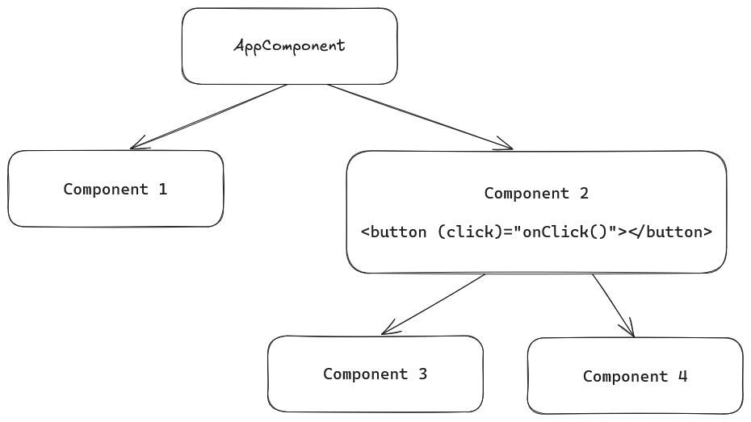
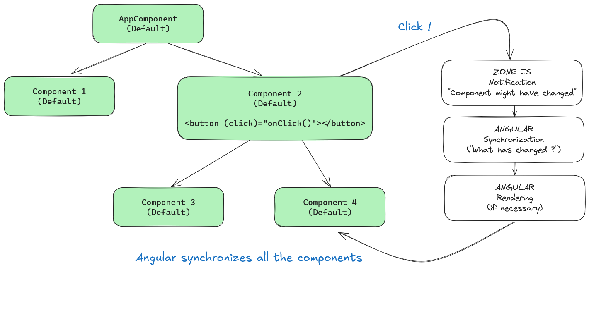
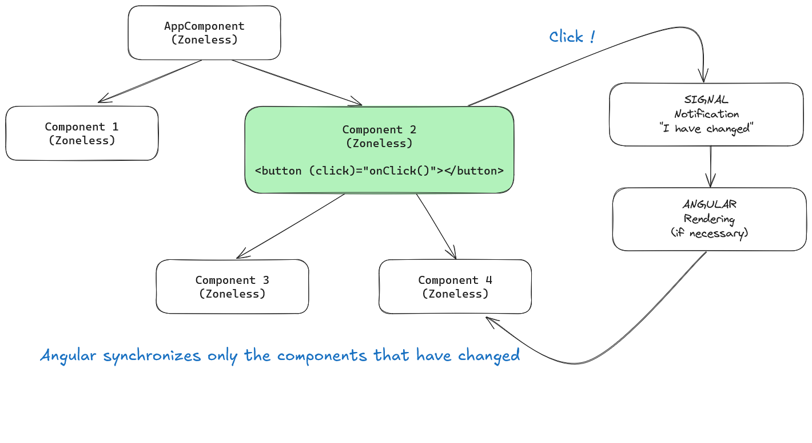

# Signals

<!-- .slide: class="page-title" -->


## Summary

<!-- .slide: class="toc" -->

- [Getting started](#/1)
- [Workspace](#/2)
- [Technical prerequisites](#/3)
- [Components](#/4)
- [Unit testing](#/5)
- [Control flow](#/6)
- [Directives](#/7)
- **[Signals](#/8)**
- [Services](#/9)
- [Pipes](#/10)
- [Http](#/11)
- [Routing](#/12)
- [Forms](#/13)
- [Appendix](#/14)

Notes :
ECMA proposal for signal
https://github.com/tc39/proposal-signals

If the interns ask how it works before, talk about the Zone.js and of the change detection strategy that Angular has 
always used before the introduction of the signals.


## Signals - Definition

- A signal is a **wrapper around a value** that **notifies interested consumers** when that value changes

- Signals **can contain any value**, from primitives to complex data structures

- You **read a signal**'s value by calling its **getter function**, which allows Angular to **track where the signal is used**

- Signals may be either **writable** or **read-only**

😉 *Later, we'll talk about a process called **synchronization** to understand when and why you should **use signals rather than raw values** to manage the state of your application...*

Notes :


## Signals - signal

- Use `signal` function to create a writable signal

```ts
import { signal } from '@angular/core';

const count = signal<number>(0);

console.log(count());                 // <-- output: 0

count.set(1);

console.log(count());                 // <-- output: 1

count.update((c) => c + 1);

console.log(count());                 // <-- output: 2
```

Notes :


## Signals - computed

- Use `computed` function to derive signal from other signals

- Re-evaluated only when the signals on which they depend change

- Computed signals are read-only

```ts
import { signal, computed } from '@angular/core';

const count = signal<number>(0);

const isEven = computed(() => count() % 2 === 0);

console.log(isEven());                 // <-- output: true

count.set(1);

console.log(isEven());                 // <-- output: false

count.update((c) => c + 1);

console.log(isEven());                 // <-- output: true
```

Notes :


## Signals - effect

- Use `effect` function to run "side-effect", whenever one or more signal values change

- Re-evaluated only when the signals on which they depend change

- Effect signals run at least once

```ts
import { signal, effect } from '@angular/core';

const count = signal<number>(0);

effect(() => {
  console.log('The current count is: ', count()); // <-- Will output: 0, 1, 2
});

count.set(1);

count.update((c) => c + 1);
```

Notes :


## Signals - Synchronization process

- The goal of synchronization is to keep the **UI** in sync with the **state** of the application
- This is a very complex process: for a better understanding, let's take an example!

Here's a common component tree: component 2 has a button. When a user clicks on the button:
- Who notifies Angular that it must perform a synchronization to reflect the changes?
- How Angular knows the components it has to re-render?


Notes :


## Signals - Synchronization (default)

Without Signals:
- **Zone.js** (a third-party library) notifies Angular when to trigger the synchronization
- Because Zone.js doesn't provide any information about which parts have actually changed, Angular must check every component


Notes :


## Signals - Synchronization process (Signals)

With Signals (aka **Zoneless component**):
- The Signal itself notifies Angular when to trigger the synchronization
- With Signals, Angular knows exactly which components have changed: Angular synchronizes only the components that need to be re-render (we don't need **Zone.js** anymore!)



Notes :


## Signals - Synchronization process (resources)

😉 *A deeper understanding of the synchronization process goes beyond the scope of this training*

- In-depth resources: https://angular.dev/guide/experimental/zoneless

Notes :


## Signals - Usage in components

- When a signal changes, Angular will automatically re-render the templates that depend on it

- This process is highly efficient, whether the signal is modified in the component itself or in another part of the application

```ts
import { Component, signal } from '@angular/core';

@Component ({
  selector: 'app-counter-delay',
  template: `<button (click)="increment()">{{ count() }}</button>`
})
export class CounterDelayComponent {
  count = signal(0);

  increment() {
    // Angular will correctly synchronize the UI with the updated signal value,
    // even if the signal mutation occurs asynchronously!
    setTimeout(() => this.count.update((count) => count + 1), 1000);
  }
}
```

Notes :


## Signals - Component input and model

Note that the `input` and `model` functions, mentioned in the chapter on components, are in fact signals.
This design makes communication between components highly reactive.

```ts
import { Component, model, signal } from '@angular/core';

@Component ({
  selector: 'app-counter',
  template: `<button (click)="increment()">{{ count() }}</button>`
})
export class CounterComponent {
  count = model(0);
  increment() { this.count.update((count) => count + 1); }
}

@Component ({
  selector: 'app-root',
  imports: [CounterComponent],
  template: `<app-counter [(count)]="appCount" /> <p>{{ appCount() }}</p>`
})
export class AppComponent {
  appCount = signal(0);
}
```

Notes :


<!-- .slide: class="page-questions" -->


<!-- .slide: class="page-tp7" -->
